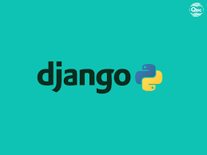

- ### Hi there, I'm Shyam Goli👋
    
 

  ## I'm a Python Developer, Computer Engineer, BackEnd Developer, Machine learning and Artificial Intelligence Practitioner 

---

  * 🔭 I am Currently working as **Python Developer** at [Capgemini](https://www.capgemini.com/)      

  - 🌱 I’m currently Learning Machine learning and Deep Learning😎.
  
  - 🥅 2024 Goals: Explore the more and more research of Machine Learning, Deep learning, Time Series Analysis, etc.

  - ⚡ Fun fact: I love to code.

---
|  |  |
| ------------------------------------------------------------ | ------------------------------------------------------------ |
|  |                                                              |

   ## ⚡ Technologies I use 

<table align="center">
    <tr>
        <td align="center" width="140" height="112.43">
            
              Python
        </td>
        <td align="center" width="140" height="112.43">
            
              Jupyter
        </td>
        <td align="center" width="140" height="112.43">
            
              TensorFlow
        </td>
        <td align="center" width="140" height="112.43">
            
              Scikit Learn
        </td>
        <td align="center" width="140" height="112.43">
            
              Flask
        </td>
        <td align="center" width="140" height="112.43">
            
              Django
        </td>
        <td align="center" width="140" height="112.43">
            
              RestAPI
        </td>
    </tr>
</table>

 

### Important Repository

💾 Python Development Folder - [🔗](https://github.com/GOLISHYAMP/ML_AI)

💾 Google colab AI/ML - [🔗](https://github.com/GOLISHYAMP/Colab_Notebooks)

💾 ML End_to_End Project - [🔗](https://github.com/GOLISHYAMP/ML_end_to_end_Project)  [visit_App](https://mlendtoendproject-dq7v3u4zhmexrqwqxrxpry.streamlit.app/)

---

***Thanks for visit my profile.***
